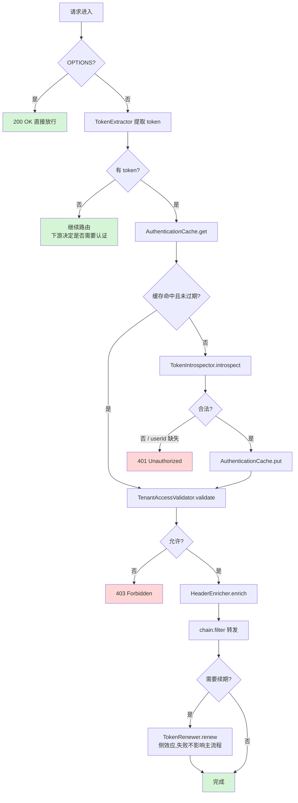

# ArchAIHarness Gateway · 架构手册

> 本文档面向架构师与核心开发者,详细描述网关的设计意图、流程、SPI 契约与配置参考。
> 面向使用者的入门请看 [README.md](./README.md);面向 AI 协作者的约束请看 [AGENTS.md](./AGENTS.md)。

---

## 1. 设计目标

| 维度 | 目标 |
|------|------|
| **业务无关** | 框架不假设具体的 Token 形态、租户模型、缓存后端 |
| **零侵入扩展** | 替换任何能力只需新增 `@Bean`,不改动框架代码 |
| **生产就绪** | 默认实现即可承载多租户 SaaS 真实流量(经过验证) |
| **可观测** | 关键路径打 INFO 日志,缓存/续期/拒绝事件打 WARN/DEBUG |
| **全反应式** | WebFlux + WebClient,无任何阻塞调用 |

---

## 2. 整体流程



---

## 3. SPI 契约

### 3.1 TokenExtractor

```java
String extract(ServerHttpRequest request);
```

| 项 | 约定 |
|----|------|
| 返回值 | 含 `Bearer ` 前缀的完整 token;无 token 返回 `null` |
| 默认行为 | 优先 Authorization 头;回退 `token` 查询参数;自动补全 Bearer 前缀 |
| 自定义场景 | 从 Cookie / 自定义 Header / WebSocket 子协议提取 |

### 3.2 TokenIntrospector

```java
Mono<AuthenticationResult> introspect(String bearerToken);
```

| 项 | 约定 |
|----|------|
| 返回值 | `AuthenticationResult`,`isValid()` 表示是否合法 |
| 异常语义 | 基础设施异常(auth 服务不可达)以 `Mono.error` 抛出,会触发 503 响应 |
| 默认实现 | `RemoteAuthTokenIntrospector` — GET 到 `archai.gateway.auth.url`,读响应 Header |
| 替代实现 | 本地 JWT 验签、OAuth2 Introspection、混合策略 |

### 3.3 AuthenticationCache

```java
AuthenticationResult get(String token);
void put(String token, AuthenticationResult result);
void clear();
```

| 项 | 约定 |
|----|------|
| key 处理 | 实现必须对原始 token 做摘要(默认 SHA-256),禁止明文存储 |
| 淘汰策略 | 同时考虑 `exp` 与 `lastAccess`(默认 TTL 300s) |
| 默认实现 | `InMemoryAuthenticationCache`(ConcurrentHashMap + 定时清理) |
| 替代实现 | Redis、Hazelcast、Caffeine + Sync 等 |

### 3.4 TenantAccessValidator

```java
Mono<Void> validate(ServerWebExchange exchange,
                    AuthenticationResult authentication,
                    String effectiveTenantId);
```

| 项 | 约定 |
|----|------|
| 返回值 | `null` 表示通过;非 null 的 `Mono<Void>` 表示拒绝(必须已写入响应) |
| 默认规则 | 见 [4. 多租户校验规则](#4-多租户校验规则) |
| 替代实现 | 接入 OPA / SpringSecurity ACL / 自研 RBAC |

### 3.5 HeaderEnricher

```java
void enrich(ServerHttpRequest.Builder builder,
            AuthenticationResult authentication,
            String effectiveTenantId);
```

| 项 | 约定 |
|----|------|
| 默认行为 | 写入 `x-user-id`、`x-tenant-id`、`x-tenant-ids`(名称可配) |
| 自定义场景 | 增加签名时间戳、调用链 ID、网关签发的内部 JWT |

### 3.6 TokenRenewer

```java
Mono<Void> renew(String cleanToken, ServerHttpResponse response);
```

| 项 | 约定 |
|----|------|
| 触发条件 | 当 `exp - now <= threshold` 且 `renew.enabled=true` |
| 失败语义 | 必须返回 `Mono.empty()`,不允许把异常向上抛(主请求已转发,续期是 best effort) |
| 默认实现 | POST `authUrl + endpoint`,响应体写入 `x-token-renewed` |

---

## 4. 多租户校验规则

默认 `MultiTenantAccessValidator` 的判定矩阵:

| 请求 tenantId | 用户 tenantIds | 结果 |
|---|---|---|
| 空 | 任意 | ✅ 放行(下游自行处理) |
| `*`(通配符) | 任意 | ✅ 放行(跨租户场景) |
| 具体值 X | 空 | ❌ 403(用户无任何租户权限) |
| 具体值 X | 包含 X | ✅ 放行 |
| 具体值 X | 不含 X | ❌ 403(越权) |

`effectiveTenantId` 的取值优先级:**客户端 Header > Token 解析所得**。这允许多租户用户在请求时切换上下文。

---

## 5. JWT 安全设计

**默认实现不在本地验签**,理由如下:

| 论点 | 说明 |
|------|------|
| 单一权威 | Token 的发行与撤销都在 auth 服务,网关二次验签易引入策略不一致 |
| 简化运维 | 网关无需持有/轮转签名密钥 |
| 性能可接受 | 本地缓存(默认 5 分钟)消除了「每个请求都调 auth」的开销 |

代码中读取 JWT exp 用的是 `Jwts.parser().unsecured()`,**仅**为决定是否续期。这是非安全决策,即使 exp 被伪造也不会绕过 auth 服务的权威判定。

需要本地零调用验签(例如对延迟极敏感)?提供自定义 `TokenIntrospector` 即可。

---

## 6. 配置参考(`archai.gateway.*`)

| 键 | 默认值 | 说明 |
|----|--------|------|
| `auth.url` | `http://auth` | 远程 auth 服务 base URL |
| `auth.timeout-millis` | `5000` | Auth 调用超时 |
| `cache.max-size` | `10000` | 缓存条目上限 |
| `cache.ttl-seconds` | `300` | 缓存空闲淘汰时长 |
| `cache.cleanup-interval-seconds` | `60` | 后台清理周期 |
| `tenant.enabled` | `true` | 是否启用多租户校验 |
| `tenant.wildcard` | `*` | 通配符值 |
| `renew.enabled` | `true` | 是否自动续期 |
| `renew.threshold-seconds` | `600` | 续期触发阈值(剩余有效期) |
| `renew.endpoint` | `/refresh_token` | 续期端点路径(拼到 auth.url 之后) |
| `header.user-id` | `x-user-id` | 用户 ID Header 名 |
| `header.tenant-id` | `x-tenant-id` | 当前租户 Header 名 |
| `header.tenant-ids` | `x-tenant-ids` | 可访问租户列表 Header 名 |
| `header.token-renewed` | `x-token-renewed` | 续期结果响应 Header 名 |

---

## 7. 路由

依靠 Spring Cloud Gateway `DiscoveryLocator`,**无需路由表**:

```
外部请求  →  /api/v2/{service}/...
内部转发  →  http://{service}/...     (StripPrefix(3))
服务解析  →  K8s Service Discovery (Fabric8)
```

切换到 Nacos/Eureka 只需替换 `spring-cloud-starter-kubernetes-fabric8-all` 依赖与对应 starter,无需改业务代码。

---

## 8. 健康检查与运维端点

| 端点 | 用途 |
|------|------|
| `/actuator/health/liveness` | K8s Liveness 探针 |
| `/actuator/health/readiness` | K8s Readiness 探针 |
| `/actuator/info` | 构建信息 |
| `/actuator/metrics` | Micrometer 指标 |

---

## 9. 已知约束

- 缓存为进程内,水平扩容时各实例缓存独立(可接受,因为 token 校验幂等)
- Token 续期是 best-effort,客户端必须能容忍偶发未续期
- 网关本身不做限流/熔断(由 K8s Ingress 或专用治理层负责)

---

## 10. 演进方向

- [ ] 提供 Redis 共享缓存的 starter 模块
- [ ] 提供本地 JWT 验签的 starter 模块
- [ ] 整合 OpenTelemetry traceparent 自动注入
- [ ] 整合 Spring Cloud CircuitBreaker(可选启用)

---

> Engineered by Architects · Empowered by AI
