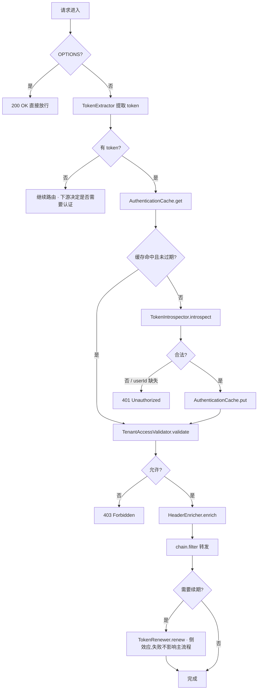

<div align="center">

# ArchAIHarness Gateway

**反应式 API 网关 · 可插拔鉴权 · 多租户访问控制 · K8s 原生**

[](https://openjdk.org/)
[](https://spring.io/projects/spring-boot)
[](https://spring.io/projects/spring-cloud-gateway)
[](https://projectreactor.io/)
[](https://kubernetes.io/)
[](./LICENSE)

</div>

---

`gateway` 是 **ArchAIHarness** 体系下的反应式 API 网关:

- 🚀 **零硬编码** —— Token 校验 / 缓存 / 租户校验 / Header 透传 / Token 续期全部基于 SPI,默认实现开箱即用,业务定制只需一个 `@Bean`
- 🧩 **配置即行为** —— Header 名、Auth URL、TTL、阈值统一收敛到 `archai.gateway.*`,无 magic string
- 🏛 **K8s 原生** —— Spring Cloud Kubernetes 服务发现 + DiscoveryLocator 自动路由,无需路由表维护
- 🔒 **多租户内建** —— `x-tenant-id` / `x-tenant-ids` 模型默认支持,通配符 `*` 表达跨租户访问
- ⚡ **全反应式** —— WebFlux + WebClient,禁绝任何阻塞 API

| 项目 | 内容 |
|------|------|
| **文档版本** | 1.0.0 |
| **维护者** | ArchAIHarness Architects |
| **更新记录** | 2026-06-02 1.0.0 · 从 api-gateway 提炼,引入 6 个 SPI 与零硬编码配置 |

> 文档结构:**先开箱即用**(§一),再深入设计意图与 SPI 契约(§二 及以后)。AI 协作约束见 [AGENTS.md](./AGENTS.md)。

## 一、5 分钟开箱即用

### 1.1 三件套依赖

```bash
# 1) 检查环境
java --version        # 期望 17
mvn --version         # 期望 3.8+
docker --version      # 期望 20+
```

### 1.2 跑起来

```bash
# 1) 克隆
git clone https://github.com/ArchAIHarness/gateway.git
cd gateway

# 2) 编译打包
mvn clean package -DskipTests

# 3) 启动(裸机本地试跑;K8s 部署见 §1.5)
java -jar target/gateway-1.0.0-SNAPSHOT.jar

# 4) 健康验证
curl http://localhost:8080/actuator/health/readiness
# 期望: {"status":"UP"}
```

### 1.3 默认行为速查

启动后,网关已经具备完整能力,**零配置可用**。下表说明默认实现对各种请求的反应:

| 请求情形 | 默认行为 | 涉及 SPI |
|---|---|---|
| `OPTIONS /xxx`(CORS 预检) | 直接 200 放行 | — |
| 无 `Authorization` 头的请求 | 直接路由到下游,由下游决定是否要求登录 | `TokenExtractor` |
| 带 `Bearer xxx` 的请求 | 查缓存 → 命中走缓存;未命中调 `http://auth` 校验 | `TokenIntrospector` + `AuthenticationCache` |
| Token 无效 / 缺 userId | 返回 `401 Invalid token` | — |
| Auth 服务不可达 | 返回 `503 Auth service unavailable` | — |
| 请求 Header 带 `x-tenant-id: t1`,用户可访问 `t1,t2` | 透传 → 放行 | `TenantAccessValidator` + `HeaderEnricher` |
| 请求 Header 带 `x-tenant-id: t9`,用户只有 `t1,t2` | 返回 `403 Forbidden: tenant not accessible` | `TenantAccessValidator` |
| 请求 Header 带 `x-tenant-id: *` | 跨租户访问,放行 | `TenantAccessValidator` |
| Token 剩余有效期 < 10 分钟 | 转发后自动 POST `auth/refresh_token`,新 token 通过响应头 `x-token-renewed` 返回 | `TokenRenewer` |

### 1.4 路由约定

依赖 Spring Cloud Gateway `DiscoveryLocator`,**不需要手写路由表**:

```
客户端请求       → /api/v2/{service}/path/to/resource
StripPrefix(3)  → /path/to/resource
K8s 服务发现     → http://{service}:80/path/to/resource
```

切换服务发现后端(Nacos / Eureka)只需替换 `spring-cloud-starter-kubernetes-fabric8-all` 为对应 starter,**业务代码零改动**。

### 1.5 部署到 K8s

```bash
# 构建镜像
docker build -t localhost:5001/gateway:latest .

# 推送到 registry
docker push localhost:5001/gateway:latest

# 滚动更新
kubectl set image deployment/gateway gateway=localhost:5001/gateway:latest -n <namespace>
```

资源建议:**单实例 1 核 1G**,生产环境至少 2 副本。探针端点已固定为 `/actuator/health/{liveness,readiness}`,在 K8s 清单中直接引用即可。

### 1.6 常用运维端点

| 端点 | 用途 |
|------|------|
| `/actuator/health/liveness` | K8s Liveness 探针 |
| `/actuator/health/readiness` | K8s Readiness 探针 |
| `/actuator/info` | 构建信息 |
| `/actuator/metrics` | Micrometer 指标 |

### 1.7 故障排查速查

> ⚠️ **禁止使用 `kubectl port-forward`**,所有访问必须经由 Ingress → Service → Pod,以确保链路与生产一致。

```bash
# 看 Pod 状态与日志
kubectl get pods -n <ns> -l app=gateway
kubectl logs -n <ns> -l app=gateway --tail=100 -f

# 路由探活
curl -k https://<gateway-host>/api/v2/auth/health
```

常见症状对照:

| 症状 | 可能原因 | 排查方向 |
|------|---------|---------|
| 401 Invalid token | Token 过期 / Auth 不识别 | 检查 auth 服务日志,看入参 token 是否在白名单 |
| 401 但 Token 看着没问题 | Auth 响应缺 `x-user-id` 头 | 确认 auth 服务的合约:成功响应必须含 `x-user-id` |
| 503 Auth service unavailable | Auth Pod 未就绪 / K8s DNS 异常 | `kubectl get endpoints auth -n <ns>` |
| 403 Forbidden: tenant... | 请求 `x-tenant-id` 不在用户授权列表 | 看日志 `Tenant access denied` 行 |
| 路由 404 | 目标服务未注册到 K8s | `kubectl get svc -n <ns>`,确认服务存在 |
| Token 不续期 | 剩余有效期 > 阈值 | 验证 `archai.gateway.renew.threshold-seconds` 配置 |

## 二、设计目标

| 维度 | 目标 |
|------|------|
| **业务无关** | 框架不假设具体的 Token 形态、租户模型、缓存后端 |
| **零侵入扩展** | 替换任何能力只需新增 `@Bean`,不改动框架代码 |
| **生产就绪** | 默认实现即可承载多租户 SaaS 真实流量(经过验证) |
| **可观测** | 关键路径打 INFO 日志,缓存/续期/拒绝事件打 WARN/DEBUG |
| **全反应式** | WebFlux + WebClient,无任何阻塞调用 |

---

## 三、整体流程

下图展示一次请求在过滤器内的完整生命周期。所有方框标注了责任 SPI,每一格都可通过 `@Bean` 替换。



---

## 四、SPI 契约

### 4.1 TokenExtractor

```java
String extract(ServerHttpRequest request);
```

| 项 | 约定 |
|----|------|
| 返回值 | 含 `Bearer ` 前缀的完整 token;无 token 返回 `null` |
| 默认行为 | 优先 Authorization 头;回退 `token` 查询参数;自动补全 Bearer 前缀 |
| 自定义场景 | 从 Cookie / 自定义 Header / WebSocket 子协议提取 |

### 4.2 TokenIntrospector

```java
Mono<AuthenticationResult> introspect(String bearerToken);
```

| 项 | 约定 |
|----|------|
| 返回值 | `AuthenticationResult`,`isValid()` 表示是否合法 |
| 异常语义 | 基础设施异常(auth 服务不可达)以 `Mono.error` 抛出,会触发 503 响应 |
| 默认实现 | `RemoteAuthTokenIntrospector` — GET 到 `archai.gateway.auth.url`,读响应 Header |
| 替代实现 | 本地 JWT 验签、OAuth2 Introspection、混合策略 |

### 4.3 AuthenticationCache

```java
AuthenticationResult get(String token);
void put(String token, AuthenticationResult result);
void clear();
```

| 项 | 约定 |
|----|------|
| key 处理 | 实现必须对原始 token 做摘要(默认 SHA-256),禁止明文存储 |
| 淘汰策略 | 同时考虑 `exp` 与 `lastAccess`(默认 TTL 300s) |
| 默认实现 | `InMemoryAuthenticationCache`(ConcurrentHashMap + 定时清理) |
| 替代实现 | Redis、Hazelcast、Caffeine + Sync 等 |

### 4.4 TenantAccessValidator

```java
Mono<Void> validate(ServerWebExchange exchange,
                    AuthenticationResult authentication,
                    String effectiveTenantId);
```

| 项 | 约定 |
|----|------|
| 返回值 | `null` 表示通过;非 null 的 `Mono<Void>` 表示拒绝(必须已写入响应) |
| 默认规则 | 见 [§五. 多租户校验规则](#五多租户校验规则) |
| 替代实现 | 接入 OPA / SpringSecurity ACL / 自研 RBAC |

### 4.5 HeaderEnricher

```java
void enrich(ServerHttpRequest.Builder builder,
            AuthenticationResult authentication,
            String effectiveTenantId);
```

| 项 | 约定 |
|----|------|
| 默认行为 | 写入 `x-user-id`、`x-tenant-id`、`x-tenant-ids`(名称可配) |
| 自定义场景 | 增加签名时间戳、调用链 ID、网关签发的内部 JWT |

### 4.6 TokenRenewer

```java
Mono<Void> renew(String cleanToken, ServerHttpResponse response);
```

| 项 | 约定 |
|----|------|
| 触发条件 | 当 `exp - now <= threshold` 且 `renew.enabled=true` |
| 失败语义 | 必须返回 `Mono.empty()`,不允许把异常向上抛(主请求已转发,续期是 best effort) |
| 默认实现 | POST `authUrl + endpoint`,响应体写入 `x-token-renewed` |

---

## 五、多租户校验规则

默认 `MultiTenantAccessValidator` 的判定矩阵:

| 请求 tenantId | 用户 tenantIds | 结果 |
|---|---|---|
| 空 | 任意 | ✅ 放行(下游自行处理) |
| `*`(通配符) | 任意 | ✅ 放行(跨租户场景) |
| 具体值 X | 空 | ❌ 403(用户无任何租户权限) |
| 具体值 X | 包含 X | ✅ 放行 |
| 具体值 X | 不含 X | ❌ 403(越权) |

`effectiveTenantId` 的取值优先级:**客户端 Header > Token 解析所得**。这允许多租户用户在请求时切换上下文。

---

## 六、JWT 安全设计

**默认实现不在本地验签**,理由如下:

| 论点 | 说明 |
|------|------|
| 单一权威 | Token 的发行与撤销都在 auth 服务,网关二次验签易引入策略不一致 |
| 简化运维 | 网关无需持有/轮转签名密钥 |
| 性能可接受 | 本地缓存(默认 5 分钟)消除了「每个请求都调 auth」的开销 |

代码中读取 JWT exp 用的是 `Jwts.parser().unsecured()`,**仅**为决定是否续期。这是非安全决策,即使 exp 被伪造也不会绕过 auth 服务的权威判定。

需要本地零调用验签(例如对延迟极敏感)?提供自定义 `TokenIntrospector` 即可。

---

## 七、配置参考(`archai.gateway.*`)

| 键 | 默认值 | 说明 |
|----|--------|------|
| `auth.url` | `http://auth` | 远程 auth 服务 base URL |
| `auth.timeout-millis` | `5000` | Auth 调用超时 |
| `cache.max-size` | `10000` | 缓存条目上限 |
| `cache.ttl-seconds` | `300` | 缓存空闲淘汰时长 |
| `cache.cleanup-interval-seconds` | `60` | 后台清理周期 |
| `tenant.enabled` | `true` | 是否启用多租户校验 |
| `tenant.wildcard` | `*` | 通配符值 |
| `renew.enabled` | `true` | 是否自动续期 |
| `renew.threshold-seconds` | `600` | 续期触发阈值(剩余有效期) |
| `renew.endpoint` | `/refresh_token` | 续期端点路径(拼到 auth.url 之后) |
| `header.user-id` | `x-user-id` | 用户 ID Header 名 |
| `header.tenant-id` | `x-tenant-id` | 当前租户 Header 名 |
| `header.tenant-ids` | `x-tenant-ids` | 可访问租户列表 Header 名 |
| `header.token-renewed` | `x-token-renewed` | 续期结果响应 Header 名 |

---

## 八、已知约束

- 缓存为进程内,水平扩容时各实例缓存独立(可接受,因为 token 校验幂等)
- Token 续期是 best-effort,客户端必须能容忍偶发未续期
- 网关本身不做限流/熔断(由 K8s Ingress 或专用治理层负责)

---

## 九、演进方向

- [ ] 提供 Redis 共享缓存的 starter 模块
- [ ] 提供本地 JWT 验签的 starter 模块
- [ ] 整合 OpenTelemetry traceparent 自动注入
- [ ] 整合 Spring Cloud CircuitBreaker(可选启用)

---

> Engineered by Architects · Empowered by AI
